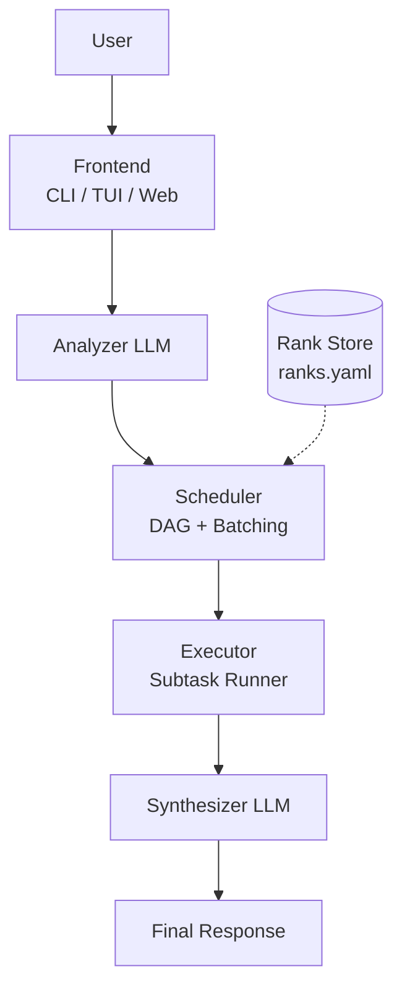
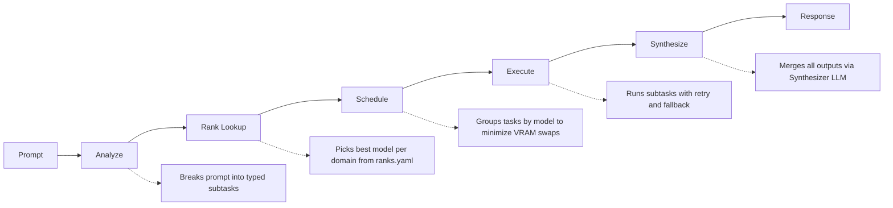
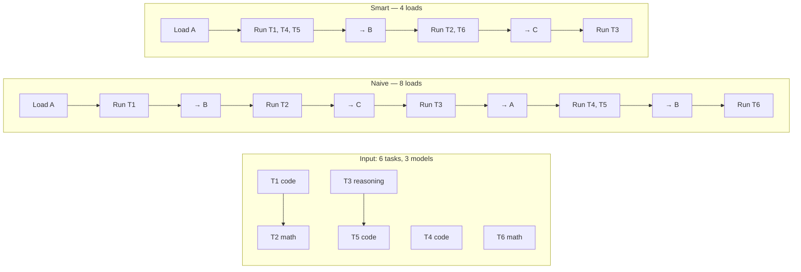

# PolyMind

**Multi-Specialist LLM Orchestrator** — CLI · TUI · Web — Local-First · Hardware-Optimised

[](https://github.com/AnkithMall/polymind/actions/workflows/ci.yml)
[](LICENSE)
[](https://www.python.org/downloads/)
[](https://github.com/psf/black)

---

## Table of Contents

1. [What is PolyMind?](#what-is-polymind)
2. [Problem Statement](#problem-statement)
3. [Architecture](#architecture)
4. [Project Structure](#project-structure)
5. [Core Pipeline](#core-pipeline)
6. [Features](#features)
7. [Installation](#installation)
8. [Quick Start](#quick-start)
9. [Usage](#usage)
10. [Configuration](#configuration)
11. [Frontends](#frontends)
12. [Comparison with Existing Tools](#comparison-with-existing-tools)
13. [Development](#development)
14. [License](#license)

---

## What is PolyMind?

PolyMind is an open-source, local-first application that orchestrates **multiple specialist LLMs** to answer a single prompt better than any one model could alone.

Instead of relying on one general-purpose model, PolyMind:

1. **Decomposes** your prompt into typed subtasks (code, math, reasoning, creative, etc.)
2. **Routes** each subtask to the model that is measurably best at that domain
3. **Schedules** execution to minimise VRAM load/unload cycles on your hardware
4. **Synthesizes** all outputs into one coherent final response

It works fully offline with Ollama or LM Studio, requires no cloud dependency, and provides three frontends — CLI, TUI, and Web UI.

---

## Problem Statement

Running a single large general-purpose model on a laptop is slow and produces mediocre results on specialist tasks. Running multiple models naively is even slower — loading and unloading models from VRAM is expensive.

**No existing tool helps users:**

- Discover which of their local models is actually best at each task type
- Automatically route subtasks to the right model based on measured accuracy
- Schedule execution to batch tasks by model, minimising VRAM swaps
- Do all of this from a terminal (or browser) with no cloud dependency

PolyMind solves all of these problems with a data-driven, hardware-aware approach.

---

## Architecture



---

### Pipeline Flow



### Smart Scheduler Algorithm

The scheduler is PolyMind's most distinctive feature. Loading a model into VRAM typically takes 5–30 seconds. Naive execution causes repeated load/unload cycles.



The smart scheduler:
1. Builds a dependency DAG from the analyzer's plan
2. Groups tasks by their assigned model
3. Walks the DAG topologically with **lookahead** — when loading a model, scans ahead for all ready tasks that use the same model
4. Executes the full batch before unloading

### Deep Dive: How the Scheduler Works

This section explains the scheduler from the ground up — what a DAG is, why topological order matters, how model-aware batching saves VRAM loads, and how the recursive lookahead algorithm works.

#### 1. Directed Acyclic Graph (DAG)

A **DAG** is a graph where:
- **Nodes** = subtasks (T1, T2, …, Tn)
- **Edges** = dependencies (T1 → T2 means "T2 depends on T1")
- **Direction** = edges point from dependency to dependent
- **Acyclic** = no circular dependencies (A needs B, B needs A is forbidden)

```
T1 (code) ──► T2 (math)     T3 (reasoning) ──► T5 (code)
                    │
                    └──► T4 (code)
```

In PolyMind, the `Analyzer` LLM reads your prompt and emits a structured plan with explicit dependency edges encoded in `depends_on`:

```python
class Subtask(BaseModel):
    id: str
    domain: DomainType       # code, math, reasoning, …
    prompt: str
    depends_on: list[str]    # IDs this task needs before it can run
    assigned_model: str | None = None  # set by _assign_models()
```

#### 2. Topological Sort (Kahn's Algorithm)

Once we have a DAG, we need an **execution order** that respects all dependencies — this is called a **topological ordering**. PolyMind uses **Kahn's algorithm**:

```
in_degree  = number of dependencies each task has (edges pointing TO it)
ready      = queue of tasks with in_degree == 0 (nothing blocks them)

while ready is not empty:
    pick a task from ready
    add it to the ordered result
    for each task that depends on it:
        decrement its in_degree
        if in_degree reaches 0 → it's now ready, add to ready

if ordered.length < total_tasks:
    a cycle exists — fall back to appending remaining tasks
```

Example: given the DAG above:

| Step | Task | in_degree before | Action |
|------|------|-----------------|--------|
| 1 | T1 | 0 | Ready initially, pick it |
| 2 | T3 | 0 | Ready initially, pick it |
| 3 | T2 | 1→0 | T1 done → T2 unblocked, pick it |
| 4 | T4 | 0 | T2 done → T4 unblocked, pick it |
| 5 | T5 | 1→0 | T3 done → T5 unblocked, pick it |

Result: T1 → T3 → T2 → T4 → T5 (topologically valid)

#### 3. Model Assignment

Before scheduling, each task is assigned a model by `_assign_models()`:

```python
for subtask in plan.subtasks:
    if rank_store has an entry for subtask.domain:
        use the top-ranked model
    elif fallback_models are configured:
        use the first fallback matching the source filter
    else:
        use the default model
```

This is a **rank-based routing** — the model with the highest benchmark score for that domain gets the task.

#### 4. The Model-Aware Batching Problem

Now we have:
- A topological order
- Each task assigned to a model (A, B, or C)

**Naive execution** = run tasks one-by-one in topological order, loading/unloading at every model switch:

```
Load A → T1 → Unload A → Load B → T2 → Unload B → Load C → T3 → ...
```

Each model load takes **5–30 seconds** on typical hardware. For 10 model switches, that's up to 5 minutes of pure loading overhead.

**Goal**: batch all consecutive tasks that use the **same model** into a single load event.

#### 5. Recursive Lookahead Algorithm

The core optimization is `_model_aware_batches()`:

```
ready         = queue of tasks whose dependencies are met
scheduled     = set of tasks already assigned to a batch
in_degree     = remaining dependency count (decremented as deps complete)
dependents    = reverse edges: for each task, which tasks depend on it

while ready is not empty:
    pick a task from ready → this starts a new batch
    model = task.assigned_model

    ┌─ Phase 1: Group all currently-ready tasks with the same model ─┐
    drain remaining ready queue into a list
    for each candidate in that list:
        if candidate also uses 'model':
            add to current batch
        else:
            put back in ready queue

    ┌─ Phase 2: Recursive lookahead ────────────────────────────────┐
    for every task now in the batch:
        for each dependent that was blocked by this task:
            decrement in_degree
            if in_degree reaches 0:
                if this newly-ready task uses 'model':
                    add to batch → continue processing its dependents
                else:
                    add to ready queue for a future batch

    repeat Phase 2 until no more same-model tasks become ready
    → commit the batch
```

**Why recursive lookahead matters**: Without it, tasks that become unblocked *during* a batch but use the same model would require a separate load. Recursive lookahead catches them, potentially eliminating extra loads.

#### 6. Worked Example

Prompt: *"Write a Python script to analyze stock data and visualize trends"*

The Analyzer decomposes this into:

| Task | Domain | Dependencies | Assigned Model |
|------|--------|-------------|----------------|
| T1 | code | — | llama3.2 (model-a) |
| T2 | math | T1 | qwen2.5-math (model-b) |
| T3 | reasoning | — | mistral (model-c) |
| T4 | code | — | llama3.2 (model-a) |
| T5 | code | T3 | llama3.2 (model-a) |
| T6 | math | — | qwen2.5-math (model-b) |

DAG:
```
T1 ──► T2     T3 ──► T5
                   
T4              T6
```

**Step-by-step execution of the algorithm:**

| Round | Ready Queue | Pick | Batch (Phase 1) | Lookahead (Phase 2) | Batch Committed |
|-------|-------------|------|-----------------|---------------------|-----------------|
| 1 | T1, T3, T4, T6 | T1 (A) | T4 (A) added | T2 unblocked (B) → ready | [A]: T1, T4 |
| 2 | T3, T6, T2 | T3 (C) | — | T5 unblocked (A) → ready | [C]: T3 |
| 3 | T6, T2, T5 | T6 (B) | T2 (B) added | — | [B]: T6, T2 |
| 4 | T5 | T5 (A) | — | — | [A]: T5 |

**Model loads**: A → C → B → A = **4 loads** (vs. 6 loads naive)

#### 7. Strategy Comparison

| Strategy | Algorithm | Use Case | Model Loads |
|----------|-----------|----------|-------------|
| `sequential` | Topological sort, one task per batch | Debugging, minimal VRAM | Highest |
| `model_aware` | Recursive lookahead batching | Default — balances VRAM and parallelism | Low |
| `parallel` | All ready tasks per round (grouped by model) | High-RAM servers, cloud APIs | Varies |

You can see this optimization live by running:

```bash
polymind --verbose ask "Explain quantum computing"
```

This prints the DAG, model assignments, batches, and load-count comparison to the terminal.

---

## Project Structure

```
polymind/
├── pyproject.toml                  # Project config, deps, entry points
├── .github/workflows/ci.yml        # CI: pytest on push (3.11, 3.12)
│
├── src/polymind/
│   ├── __init__.py                 #   Public API exports
│   │
│   ├── core/                       # ★ Core library (provider-agnostic)
│   │   ├── __init__.py
│   │   ├── types.py                #   Pydantic models + RankingMode enum
│   │   ├── config.py               #   YAML config loader with ${ENV_VAR}
│   │   ├── providers.py            #   LiteLLM model string builder
│   │   ├── fallback.py             #   Retry with backoff + fallback chain
│   │   ├── analyzer.py             #   Router LLM: prompt → subtask plan
│   │   ├── executor.py             #   Subtask execution with retry/context
│   │   ├── synthesizer.py          #   Merge subtask outputs (streaming + non)
│   │   ├── scheduler.py            #   DAG builder, topological sort,
│   │   │                           #     model-aware batching
│   │   ├── benchmark.py            #   9 domain × 5 tasks, scoring,
│   │   │                           #     ranks.yaml I/O
│   │   ├── hardware.py             #   RAM/VRAM/CPU scanner + auto-detect providers
│   │   ├── logging_setup.py        #   Debug logging via --verbose flag
│   │   └── context.py              #   Token estimation, budget manager
│   │
│   ├── cli/                        # CLI frontend (Typer + Rich)
│   │   ├── __init__.py
│   │   └── main.py                 #   Commands: ask, benchmark, ranks, status,
│   │                               #     diff, config (init, add-provider, auto-detect)
│   │
│   ├── tui/                        # TUI frontend (Textual)
│   │   ├── __init__.py
│   │   ├── __main__.py             #   Entry: python3 -m polymind.tui
│   │   └── app.py                  #   Chat + pipeline inspector + ConfigScreen
│   │                               #   (model add/remove, auto-detect, verbose)
│   │
│   └── web/                        # Web frontend (FastAPI + SSE)
│       ├── __init__.py
│       ├── app.py                  #   API: /api/ask, /api/benchmark,
│       │                           #   /api/providers/detect, /api/config
│       └── static/
│           └── index.html          #   SPA with chat, config, and benchmark tabs
│
└── tests/                          # 116+ tests across all modules
    ├── test_types.py
    ├── test_config.py
    ├── test_providers.py
    ├── test_fallback.py
    ├── test_analyzer.py
    ├── test_executor.py
    ├── test_synthesizer.py
    ├── test_scheduler.py
    ├── test_benchmark.py
    ├── test_hardware.py
    ├── test_context.py
    ├── test_profiles.py
    └── test_cli.py
```

---

## Core Pipeline

### 1. Analyze (`core/analyzer.py`)
A lightweight router LLM reads the prompt and emits a structured JSON plan: a list of subtasks with domain tags and dependency edges. If the router is unavailable or returns invalid JSON, PolyMind falls back to a single-task plan with domain `general`.

### 2. Schedule (`core/scheduler.py`)
- **Model assignment**: each subtask's domain is looked up in `ranks.yaml`; the best model is assigned based on the configured `ranking_mode` (accuracy, cost, or cost_effective)
- **Model source filter**: models can be restricted to `local`, `online`, or `all` via the `model_source` config option
- **DAG construction**: dependency edges form a directed acyclic graph
- **Topological sort**: Kahn's algorithm produces a valid execution order
- **Lookahead batching**: when loading a model, all ready tasks using that model are batched together, minimising VRAM swaps

Three strategies available:
| Strategy | Description | Use Case |
|----------|-------------|---------|
| `model_aware` | Batch tasks by model with lookahead | Default, best for < 16GB VRAM |
| `sequential` | One task per batch, dependency order | Debugging, minimal VRAM |
| `parallel` | All ready tasks execute per round | High-RAM servers |

### 3. Execute (`core/executor.py`)
Each subtask is passed to its assigned model via LiteLLM. Execution includes:
- **Retry with exponential backoff** (configurable, default 2 retries)
- **Fallback chain** (primary → fallback → error)
- **Context injection** — prior outputs from dependencies are prepended
- **Keep-alive** — Ollama's `keep_alive` parameter keeps models warm

### 4. Synthesize (`core/synthesizer.py`)
A configurable synthesizer model receives the original prompt and all subtask outputs, producing a single coherent response. Supports both non-streaming and async streaming modes.

---

## Features

### Core (MVP)

| Feature | File | Description |
|---------|------|-------------|
| **Prompt Decomposition** | `core/analyzer.py` | Router LLM breaks prompts into typed subtasks with dependency graphs |
| **Model Benchmarking** | `core/benchmark.py` | 9 domains × 5 benchmark tasks; exact-match + LLM-as-judge scoring |
| **Auto-Detect Providers** | `core/hardware.py` | Detects local Ollama and LM Studio models automatically |
| **Cost Tracking** | `core/benchmark.py` | Tracks token usage and computes cost per model during benchmarks |
| **Cost-Based Ranking** | `core/types.py` | Ranking modes: `accuracy`, `cost`, `cost_effective` (accuracy ÷ cost) |
| **Model Source Filter** | `core/scheduler.py` | Filter models by source: `local`, `online`, or `all` |
| **LiteLLM Proxy** | `core/config.py` | Route all calls through a LiteLLM proxy server |
| **Smart Scheduling** | `core/scheduler.py` | DAG-based model-aware batching reduces VRAM load events by 40-60% |
| **Multi-Provider** | `core/providers.py` | Ollama, LM Studio, OpenRouter, OpenAI, Anthropic via LiteLLM |
| **Fallback Chain** | `core/fallback.py` | Retry with backoff → fallback model → error result |
| **Config Management** | `core/config.py` / `cli/main.py` | YAML config with `${ENV_VAR}` resolution + interactive CLI wizards |
| **Verbose Logging** | `core/logging_setup.py` | Global `--verbose` flag enables debug logging across CLI, TUI, and Web |

### Polish Features

| Feature | File | Description |
|---------|------|-------------|
| **Hardware Profiler** | `core/hardware.py` | Scans RAM/VRAM/CPU, recommends optimal strategy |
| **Provider Auto-Detect** | `core/hardware.py` | `detect_local_providers()` for Ollama + LM Studio |
| **Context Budget** | `core/context.py` | Token estimation, truncation, 17 model family limits |
| **Routing Profiles** | `core/config.py` | `quality`/`fast`/`private` presets |
| **Keep-Alive** | `core/executor.py` | Ollama model warm-up between batches |
| **TUI Config Screen** | `tui/app.py` | In-app model add/remove, auto-detect, verbose toggle |
| **Web Config API** | `web/app.py` | `GET /api/providers/detect`, `POST /api/config` |
| **Web Config UI** | `web/static/index.html` | Config tab with model management + verbose checkbox |

### Frontends

| Frontend | Framework | Entry Point |
|----------|-----------|-------------|
| **CLI** | Typer + Rich | `polymind` |
| **TUI** | Textual | `polymind-tui` |
| **Web UI** | FastAPI + SSE | `polymind-web` (→ `http://127.0.0.1:8765`) |

### CLI Commands

Global flags:

| Flag | Description |
|------|-------------|
| `--verbose` / `-v` | Show detailed debug logs of what is happening |

Commands:

| Command | Description |
|---------|-------------|
| `polymind ask <prompt>` | Run a prompt through the full pipeline |
| `polymind benchmark [models...]` | Run benchmark tasks against models |
| `polymind benchmark --auto-detect` | Auto-detect models from all configured providers |
| `polymind ranks` | Display all model rankings |
| `polymind ranks --best` | Show only the best model per domain |
| `polymind ranks --mode <mode>` | Rank by `accuracy` / `cost` / `cost_effective` |
| `polymind status` | Show config health and rankings age |
| `polymind diff <prompt> <models...>` | Compare model outputs side by side |
| `polymind config init` | Interactive config wizard |
| `polymind config add-provider` | Add a provider/model interactively |
| `polymind config auto-detect` | Auto-detect local providers and update config |

---

## Environment Requirements

| Requirement | Version |
|-------------|---------|
| **Python** | **3.11+** (developed and tested on 3.14) |
| **OS** | Linux (Ubuntu 24.04+ recommended), macOS, WSL2 |
| **Architecture** | x86_64 (ARM64 untested) |
| **VRAM** | 8 GB+ recommended for running local models |
| **RAM** | 16 GB+ recommended |

The project pins no maximum Python version — it is forward-compatible with 3.14 and later.

## Installation

### From Source

```bash
git clone git@github.com:AnkithMall/polymind.git
cd polymind
git checkout polymind-v2
pip install -e .                    # Core only
pip install -e ".[cli]"             # Core + CLI (recommended)
pip install -e ".[tui]"             # Core + TUI
pip install -e ".[web]"             # Core + Web UI
pip install -e ".[all]"             # Everything
```

### Dependencies

| Package | Required | Purpose |
|---------|----------|---------|
| `pydantic>=2.0` | Core | Data models and validation |
| `pyyaml>=6.0` | Core | Config/session file I/O |
| `litellm>=1.40` | Core | Universal LLM API |
| `typer>=0.12` | CLI | CLI framework |
| `rich>=13.0` | CLI | Terminal formatting |
| `textual>=1.0` | TUI | Terminal UI framework |
| `fastapi>=0.100` | Web | Web server |
| `uvicorn>=0.20` | Web | ASGI server |

---

## Quick Start

### 1. Configure

```bash
polymind config init          # Interactive wizard
polymind config auto-detect   # Auto-detect local Ollama/LM Studio models
```

This creates `~/.polymind/config.yaml` interactively with your providers.

### 2. Run a Benchmark

```bash
# Benchmark specific models
polymind benchmark ollama/llama3.2:1b ollama/mistral

# Auto-detect and benchmark all local models
polymind benchmark --auto-detect

# Benchmark with verbose logging
polymind --verbose benchmark --auto-detect
```

Measures each model across 9 domains and writes results to `~/.polymind/ranks.yaml`.

### 3. Ask a Question

```bash
polymind ask "Write a Python script that fetches stock prices and analyzes trends"
```

### 4. Launch TUI

```bash
polymind-tui
```


### 5. Launch Web UI

```bash
polymind-web
# Open http://127.0.0.1:8765
```

---

## Configuration

### `~/.polymind/config.yaml`

```yaml
models:
  - name: llama3.2:1b
    provider: ollama
router_model: ollama/llama3.2:1b
synthesizer_model: null
judge_model: ollama/llama3.2:1b
scheduler:
  strategy: model_aware
  pass_context: true
data_dir: ~/.polymind
verbose: false
profile: null
keep_alive: null
litellm_proxy: null              # LiteLLM proxy base URL (e.g. http://localhost:4000)
ranking_mode: accuracy           # accuracy | cost | cost_effective
model_source: all                # local | online | all
```

### `~/.polymind/ranks.yaml`

Generated by `polymind benchmark`. Example:

```yaml
entries:
  - model: ollama/llama3.2:1b
    domain: code
    score: 0.85
    latency_ms: 2340.5
    cost: 0.0                   # $0 for local models
    timestamp: "2026-06-18T09:30:00"
  - model: ollama/mistral
    domain: code
    score: 0.92
    latency_ms: 1890.2
    cost: 0.0
    timestamp: "2026-06-18T09:35:00"
  - model: openai/gpt-4o-mini
    domain: code
    score: 0.97
    latency_ms: 870.2
    cost: 0.000423               # $0.0004 per task
    timestamp: "2026-06-18T09:40:00"
```

### Routing Profiles

| Profile | Strategy | Best For |
|---------|----------|----------|
| `quality` | model_aware | Maximum accuracy |
| `fast` | sequential | Quick responses |
| `private` | sequential | Fully offline |

Set via config: `profile: quality`

### Ranking Modes

| Mode | Behaviour | Formula |
|------|-----------|---------|
| `accuracy` | Highest benchmark score wins (default) | `score` |
| `cost` | Lowest cost per task wins | `-(cost)` |
| `cost_effective` | Best accuracy per dollar | `score / cost` |

When `ranking_mode` is set to `cost` or `cost_effective`, benchmark cost data is required for all models. Local models (Ollama, LM Studio) cost \$0. Online model pricing is built-in for common models (GPT-4o, Claude, etc.).

### Model Source Filter

| Value | Behaviour |
|-------|-----------|
| `all` | Use any provider's models (default) |
| `local` | Only use local models (Ollama, LM Studio) |
| `online` | Only use online models (OpenAI, Anthropic, OpenRouter) |

### Verbose Logging

Set `verbose: true` in config or pass `--verbose` / `-v` globally to enable debug logging:

```bash
polymind --verbose ask "What is quantum computing?"
polymind --verbose benchmark --auto-detect
```

Verbose mode works with all commands in CLI, TUI (`Ctrl+C` → Config → toggle Verbose), and Web UI (Config tab → Verbose checkbox). Debug logs show model selection, scheduling decisions, retry attempts, and timing.

### LiteLLM Proxy

Set `litellm_proxy` to a base URL to route all LLM calls through a [LiteLLM proxy](https://litellm.vercel.app/docs/proxy/proxy_server):

```yaml
litellm_proxy: "http://localhost:4000"
```

This is useful for centralized API key management, rate limiting, and cost tracking across your team.

### Environment Variables

Variables in config are resolved from the environment:

```yaml
api_key: ${OPENAI_API_KEY}
base_url: ${OLLAMA_HOST}
```

---

## Usage Examples

### CLI

```bash
# Ask with custom model
polymind ask "Explain quantum computing" --model ollama/mistral

# Ask with verbose debug logging
polymind --verbose ask "Explain recursion"

# Review subtask plan before execution
polymind ask "Build a REST API" --review

# Compare two models
polymind diff "What is the capital of France?" ollama/llama3.2:1b ollama/mistral

# Benchmark specific domains
polymind benchmark ollama/llama3.2:1b --domain code --domain math

# Auto-detect and benchmark all local models
polymind benchmark --auto-detect

# Show best model per domain by cost effectiveness
polymind ranks --best --mode cost_effective

# Interactive config management
polymind config init
polymind config add-provider
polymind config auto-detect

# Check system status
polymind status
```

### TUI Keybindings

| Key | Action |
|-----|--------|
| `Ctrl+R` | Review / override subtask plan |
| `Ctrl+M` | Cycle execution strategy |
| `Ctrl+P` | Open profile picker |
| `Ctrl+B` | Run benchmark in background |
| `Ctrl+C` | Open config screen (add/remove models, auto-detect, verbose) |
| `Ctrl+S` | Save current session |
| `Ctrl+O` | Load a session |
| `?` | Shortcut reference |
| `Q` | Quit |

---

## Comparison with Existing Tools

### How does PolyMind compare?

| Feature | PolyMind | ChatGPT | Ollama CLI | LangChain | OpenRouter |
|---------|----------|---------|------------|-----------|------------|
| **Multi-model orchestration** | ✅ Automatic | ❌ Single model | ❌ Manual | ✅ Requires code | ❌ Single model |
| **Local-first** | ✅ Full offline | ❌ Cloud-only | ✅ | ✅ | ❌ |
| **Model benchmarking** | ✅ Built-in | ❌ | ❌ | ❌ | ❌ |
| **Cost-based ranking** | ✅ accuracy / cost / cost_effective | ❌ | ❌ | ❌ | ❌ |
| **Task decomposition** | ✅ Auto | ❌ Manual | ❌ | ❌ | ❌ |
| **Auto-detect providers** | ✅ Ollama + LM Studio | ❌ | ❌ | ❌ | ❌ |
| **VRAM-aware scheduling** | ✅ DAG + lookahead | ❌ | ❌ | ❌ | ❌ |
| **CLI / TUI / Web** | ✅ All three | ❌ Web-only | ❌ CLI only | ❌ Library only | ❌ API only |
| **Verbose debugging** | ✅ Global --verbose | ❌ | ❌ | ❌ | ❌ |
| **Hardware profiling** | ✅ Auto-recommend | ❌ | ❌ | ❌ | ❌ |
| **Provider agnostic** | ✅ Ollama/LM Studio/OpenAI/Anthropic | ❌ | ❌ Ollama only | ✅ | ❌ |
| **LiteLLM proxy support** | ✅ | ❌ | ❌ | ✅ | ❌ |
| **Context budget mgmt** | ✅ | ❌ | ❌ | ❌ | ❌ |

### Are there tools that achieve the same goal with better performance?

**Current gaps vs. production systems:**

| Limitation | PolyMind (v2) | Better alternative |
|------------|--------------|-------------------|
| **Concurrent execution** | Sequential batches within a model | Parallel task execution with async I/O |
| **Distributed execution** | Single machine | Ray-based distributed scheduling |
| **Streaming during execution** | After synthesis | Real-time per-subtask streaming |
| **Caching** | None | Semantic cache for repeated subtasks |
| **Fine-tuning integration** | None | Use rankings to build fine-tuning datasets |
| **Plugin ecosystem** | Skeleton only | Full plugin SDK with pip packages |

**Roadmap items that address these gaps:**
- Parallel execution mode (sprint item)
- Semantic caching for repeated prompts
- Plugin SDK for custom domains
- Pipeline export/import for sharing

### What makes PolyMind unique?

1. **Model-aware scheduling** — No other tool batches LLM subtasks to minimise VRAM swaps. This is critical for local execution where model loading dominates latency.

2. **Data-driven routing** — Rankings are based on actual benchmark scores, not heuristics. The system improves over time as benchmarks are re-run.

3. **Three frontends from one core** — The same library powers CLI, TUI, and Web UIs, all importing from `polymind.core`.

4. **Hardware-first design** — The scheduler adapts to your hardware (RAM, VRAM, CPU cores) rather than assuming a server environment.

---

## Development

### Running Tests

```bash
./run_tests.py                    # Single-command runner with detailed summary
pytest tests/ -v                  # Standard pytest (unit + integration)
pytest tests/ -v --cov            # With coverage report
```

### Test Structure

```
tests/
├── integration/                  # Cross-module integration tests
│   ├── test_pipeline_flow.py     # Plan → schedule → execute → synthesize
│   ├── test_benchmark_flow.py    # Benchmark → save → load → query ranks
│   └── test_data_integrity.py    # depends_on refs, task counts, domains
├── test_analyzer.py              # Router prompts, JSON parsing, fallback
├── test_benchmark.py             # Task suites, scoring, ranks I/O
├── test_cli.py                   # Help, status, error handling
├── test_config.py                # YAML load, env vars, serialization
├── test_context.py               # Token estimation, budget, truncation
├── test_executor.py              # Subtask execution, context injection
├── test_fallback.py              # Retry, backoff, fallback chain
├── test_hardware.py              # Hardware info, strategy recommendation
├── test_profiles.py              # Routing profiles, keep-alive
├── test_providers.py             # Model string resolution, kwargs
├── test_scheduler.py             # DAG, topological sort, batching,
│                                 #   model-aware lookahead, describe_schedule,
│                                 #   latency guards
├── test_setup_guide.py           # Provider health checks, setup instructions
├── test_synthesizer.py           # Message building, streaming
└── test_types.py                 # Pydantic models, ranking modes
```

### Latest Test Results

```
────────────────────────────────────────────────────────────────────────
  UNIT TESTS — individual feature modules
────────────────────────────────────────────────────────────────────────
  14 files — all passed

────────────────────────────────────────────────────────────────────────
  INTEGRATION TESTS — cross-module flows
────────────────────────────────────────────────────────────────────────
  9 tests — all passed

────────────────────────────────────────────────────────────────────────
  SUMMARY
────────────────────────────────────────────────────────────────────────
  Unit tests                      14 passed,   0 failed
  Integration tests              PASS
  Total duration                  ~80s
  Exit code                       0
```

### Adding a New Provider

Add to `core/providers.py`:

```python
class ProviderType(str, Enum):
    # ... existing providers ...
    my_provider = "my_provider"
```

Update `ProviderInfo.litellm_string` property to handle the new type.

### Adding a Custom Domain

```python
from polymind.core.types import DomainType
from polymind.core.benchmark import BenchmarkTask, BUILTIN_TASKS

# Register tasks
BUILTIN_TASKS[DomainType("medical")] = [
    BenchmarkTask(DomainType("medical"), "Diagnose symptoms", "diagnosis", "llm_judge"),
    # ...
]
```

---

## License

MIT License — see [LICENSE](LICENSE).

PolyMind is free and open-source software. You are welcome to use, modify, and distribute it for personal, educational, or commercial purposes under the terms of the MIT license.

Contributions are encouraged — feel free to open issues, submit pull requests, or fork the repository.

---

## Repository

- **Branch**: `main` (default)
- **Remote**: `git@github.com:AnkithMall/polymind.git`
- **Clone**: `git clone git@github.com:AnkithMall/polymind.git`

